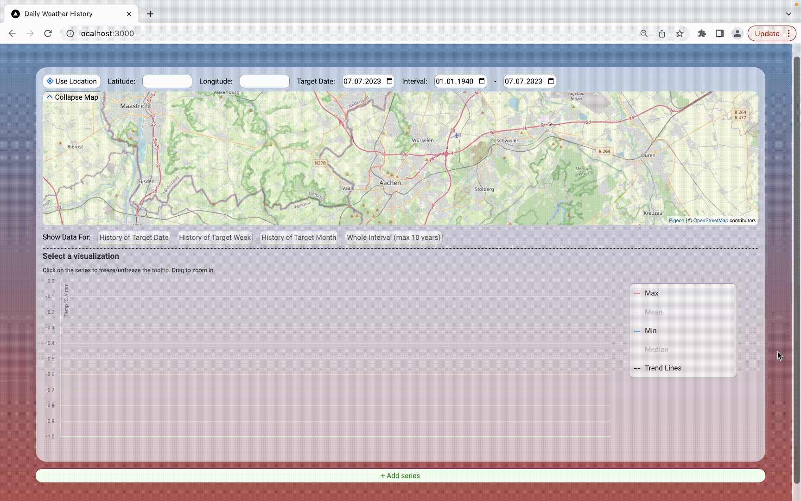

# Is today / this week / this month hotter than usual?

This web app lets you visualize and compare weather/climate trends for any geolocation. 
Inspect historical data for any specific date, calender week or month in a timespan from 1940 until today. 


A [Next.js](https://nextjs.org/) app using [React-Vis](https://uber.github.io/react-vis/), [Pigeon Maps](https://pigeon-maps.js.org), and the [Open Meteo API](https://open-meteo.com).  



## Usage

- History of Target Date: Visualizes the development of climate data at the target date for the specified location.
- History of Target Week: Visualizes the development of climate data at the target dates calender week.
- History of Target Month: Visualizes the development of climate data in the target dates month.
- Whole Interval: Shows data for each day in the specified interval. Limited to intervals up to 10 years. 

Using the '+ Add Series' button more data series can be generated for comparison. 
The legend can be used to toggle certain information on or off.

Trends are computed in line with the National Center for Atmospheric Research Staff (Eds). Last modified 05 Sep 2014. "The Climate Data Guide: Trend Analysis." Retrieved from [here](https://climatedataguide.ucar.edu/climate-data-tools-and-analysis/trend-analysis).

## Try it out

You can try the app [here](https://codesandbox.io/p/github/lmueller27/daily-weather-history/sandbox) in a sandbox.

To run it locally, clone the repo and install the dependencies:

```bash
npm install --legacy-peer-deps
```

Then run the development server:

```bash
npm run dev
```

Open [http://localhost:3000](http://localhost:3000) to use the app. 


